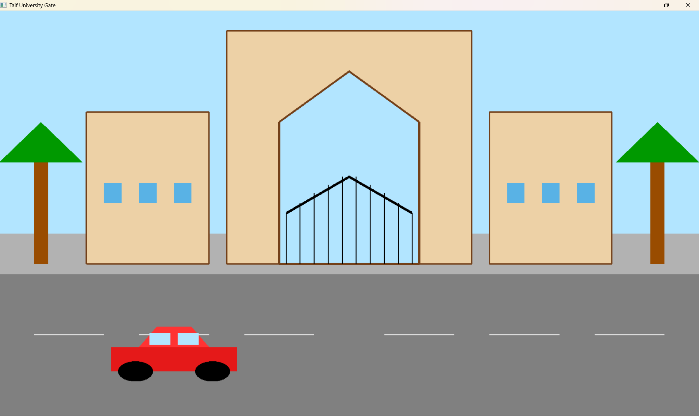
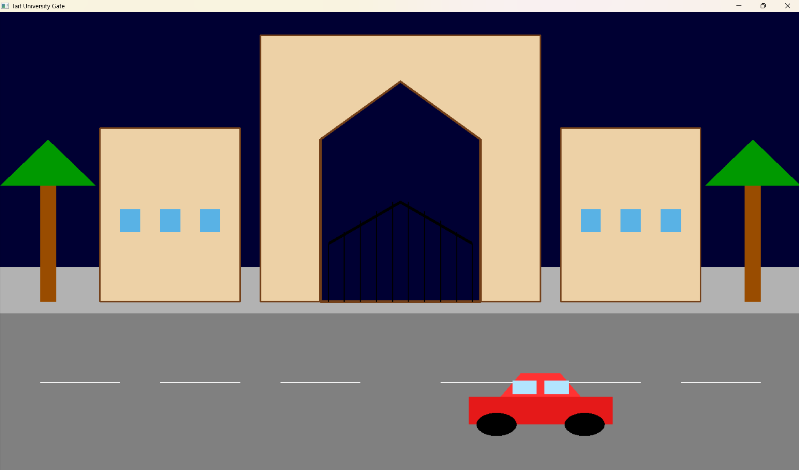

# Taif University Gate - OpenGL

A 2D OpenGL project that simulates the entrance of Taif University.

## Features

- Day mode
- Night mode
- Automatic building lights at night
- Car movement using keyboard controls
- Interactive OpenGL graphics

## Technologies

- C++
- OpenGL
- FreeGLUT

## Controls

- A : Move car left
- D : Move car right
- N : Switch to night mode
- M : Switch to day mode

## Preview

